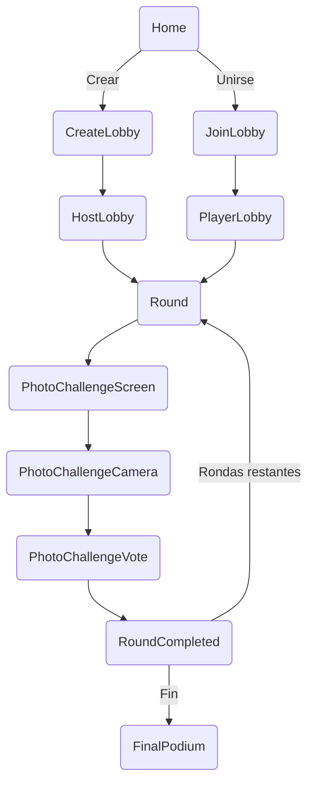

# AIParty_Front
=======
# 🎉 AIParty

> **AIParty** es una aplicación móvil (React Native + Expo) de retos fotográficos multijugador que aprovecha IA generativa (Gemini) y Firebase Realtime DB/Storage para crear partidas rápidas, dinámicas y… ¡muy divertidas!  
> Los jugadores se conectan mediante un código (o QR), reciben retos generados en tiempo real, compiten sacando la mejor foto y votan entre sí para coronar al ganador del podio final.

<div align="center">
  
</div>

## ✨ Características

| Módulo | Descripción |
| ------ | ----------- |
| 🔐 **Lobby / QR** | Crea o únete a salas (código alfanumérico + QR automático). |
| 🤖 **Retos IA** | Gemini genera retos fotográficos únicos por ronda. |
| 📸 **Cámara Expo** | Captura y sube la foto directamente al Storage de Firebase. |
| 🗳️ **Votación** | Vista de galería, un toque para votar. Tally instantáneo. |
| 🏆 **Podio Final** | Ordena puntuaciones y muestra el top 3. |
| 🔔 **Push** | Notificaciones cuando un jugador entra a la sala (dispositivo físico). |
| ⚙️ **Cross-Plataforma** | Android, iOS y Web (con fallback cuando la cámara no está disponible). |

## 🗂️ Arquitectura del proyecto

```
app/
  context/RoomContext.tsx       # Estado global de partida (Provider)
  lobby/                        # Crear / unirse / QR scanner / host & player lobby
  game/                         # Rounds + Podio final
  PhotoChallenge/               # Reto, cámara, votación y resultados
  TheChallenge/                 # (Modo penitencia opcional)
assets/                         # Imágenes y fuentes
src/services/                   # Abstracciones Firebase + Gemini
```

### Diagrama de flujo simplificado



## 🚀 Instalación rápida

1. **Clona** el repo y entra al directorio  
   ```bash
   git clone https://github.com/<tu-usuario>/AIParty.git
   cd AIParty
   ```
2. **Instala dependencias**  
   ```bash
   npm install
   ```
3. **Configura claves**  
   - `app.json` ➜ `extra.GEMINI_API_KEY`
   - `src/services/firebase.js` ➜ tus credenciales  
   *(Usa variables de entorno + babel-plugin-dotenv-import para producción)*.
4. **Arranca Expo**  
   ```bash
   npm run start       # expo start
   ```
5. Escanea el QR con Expo Go o tu build dev.

## 🛠️ Scripts útiles

| Comando | Acción |
| ------- | ------ |
| `npm run android` | Ejecuta en emulador/dispositivo Android. |
| `npm run ios` | Ejecuta en iOS. |
| `npm run web` | Levanta versión web. |

## 🧩 Principales dependencias

- **expo 53** / React Native 0.79  
- **firebase 11** (DB + Storage)  
- **expo-camera**, **expo-notifications**, **expo-image-picker**  
- **@react-navigation v7**  
- **openai >=4** (Gemini)  
- **uuid**, **socket.io-client**

## 🏗️ Estructura de datos (Realtime DB)

```jsonc
rooms: {
  [roomId]: {
    challenge: "Selfie con tu bebida favorita",
    round: 3,
    roundStartTime: 1716763843521,
    totalRounds: 4,
    timeLimit: 30,
    category: "Family friendly",
    players: { ... },
    photos: { ... },
    votes: { ... },
    scores: { ... }
  }
}
```

## 🕹️ Gameplay paso a paso

1. **Home** → crear o unirse.  
2. **CreateLobby**: define rondas, límite y categoría – genera QR.  
3. **JoinLobby**: ingresa código o escanea QR, define nombre y avatar.  
4. **Lobby**: lista de jugadores y botón *Empezar* del host.  
5. **Round** → cuenta regresiva 3‑2‑1.  
6. **PhotoChallengeScreen** muestra reto IA.  
7. **PhotoChallengeCamera** toma y sube foto.  
8. **PhotoChallengeVote** galería + votación.  
9. **RoundCompleted** sincroniza y host genera el siguiente reto.  
10. Repite hasta `totalRounds`; termina en **FinalPodium**.

## 📲 Push Notifications

- `expo-notifications` + endpoint `https://exp.host/--/api/v2/push/send`.
- Actualmente: avisa cuando un jugador entra; ampliable a más eventos.

## 🧑‍💻 Contribuir

1. Fork → `git checkout -b feat/mi-feature`  
2. Sigue convenciones *Conventional Commits*.  
3. Añade pruebas y linting.  
4. Abre un PR descriptivo hacia **main**.

## 🪲 Roadmap

- SocketIO para sync en tiempo real.  
- Chat in‑game.  
- Historial de partidas en Firestore.  
- Sonidos y skins.

## 📄 Licencia

0BSD — libre uso y distribución.

---

# 📚 Wiki

## Índice
1. [Getting Started](#getting-started)
2. [Arquitectura Detallada](#arquitectura-detallada)
3. [Flujo del Juego](#flujo-del-juego-detallado)
4. [Servicios y API](#servicios-y-api)
5. [Deploy & Build](#deploy--build)
6. [Contribución Extendida](#contribución-extendida)
7. [FAQ](#faq)

---

## Getting Started

### Requisitos

| Herramienta | Versión |
|-------------|---------|
| Node.js | ≥ 20 |
| Expo CLI | ≥ 7 |
| Firebase | RTDB + Storage |
| Gemini | API key |

```bash
npm i -g expo-cli
```

Configuración: crea proyecto Firebase, pega credenciales, añade clave Gemini en `app.json`, instala dependencias y `expo start`.

---

## Arquitectura Detallada

### Frontend

- **Navigation**: stack nativo (`@react-navigation/native-stack`).
- **Estado Global**: `RoomContext` (Context API).
- **Pantallas**: en `/app/*`.

### Backend

- **Realtime DB** para estado; **Storage** para fotos.
- Reglas recomendadas:

```jsonc
{
  "rules": {
    "rooms": {
      "$roomId": { ".read": true, ".write": true }
    }
  }
}
```

### IA Generativa

- Gemini 2.0 Flash vía REST.  
- Prompt se arma en `createRoom` y `startRound`.

---

## Flujo del Juego Detallado

| # | Pantalla | Acción |
|---|----------|--------|
| 1 | Home | Crear / Unirse |
| 2 | HostLobby o PlayerLobby | Espera jugadores |
| 3 | Round | Cuenta atrás |
| 4 | PhotoChallengeScreen | Reto IA |
| 5 | PhotoChallengeCamera | Toma foto |
| 6 | PhotoChallengeVote | Votar |
| 7 | RoundCompleted | Espera / genera siguiente |
| 8 | FinalPodium | Fin |

---

## Servicios y API

### Gemini

`generateChallenge(prompt)` → string.

### Firebase Wrappers

| Archivo | Método | Propósito |
|---------|--------|-----------|
| `playerService` | `addPlayer`, `onPlayers` | Alta y suscripción |
| `roomService` | `createRoom`, `fetchRoom`, `onRoom` | Gestión de salas |
| `voteService` | `vote`, `onScores` | Votaciones |

---

## Deploy & Build

### EAS Build

```bash
eas build --platform android --profile preview
```

Sube `google-services.json` y configura `eas.json`.

### Web

```bash
expo export:web
```

Sirve `dist/` en Netlify / Vercel.

### CI (GH Actions)

```yaml
- uses: expo/expo-github-action@v8
```

---

## Contribución Extendida

- Código siguiendo Airbnb/RN ESLint.  
- PRs con descripción clara.  
- Issues etiquetados como *bug*, *enhancement* o *question*.

---

## FAQ

**¿Puedo jugar offline?**  
No. Se requiere conexión para sincronizar datos en Firebase.

**¿La cámara funciona en web?**  
Expo Camera no soporta Web; se muestra un mensaje informativo.

**¿Qué pasa si el host se va?**  
Los datos siguen en DB; otro usuario puede iniciar la ronda manualmente.

---

> Hecho por Juan Gómez y David Medina — Powered by Expo, Firebase & Gemini AI
